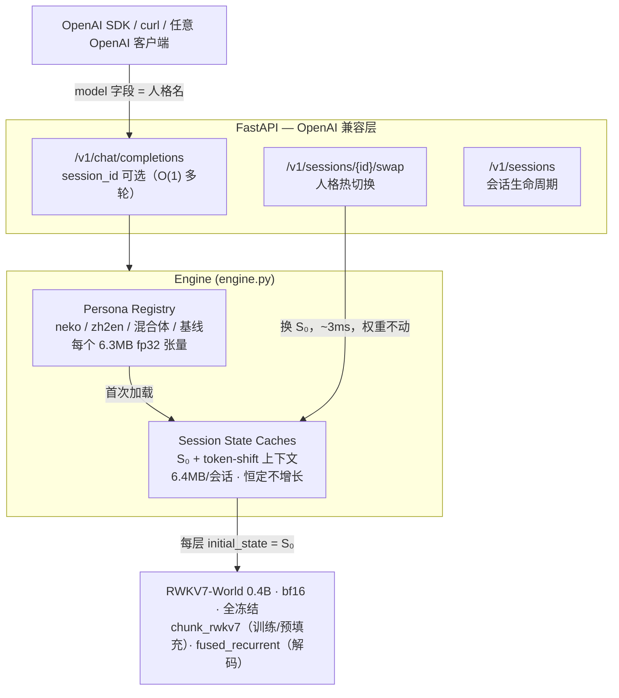

# stateswap

**一个 RWKV-7 底座，N 个人格：把人格训成几 MB 的初始状态（S0），服务时微秒级热切换。**
**One RWKV-7 base model, many personas: train each persona into a few-MB initial state (S0) and hot-swap it at serving time.**

[中文](#中文) | [English](#english)

---

<a id="中文"></a>

## 这是什么

RWKV-7 每层维护一个随 token 演化的递归状态 S（每头 64×64）。标准推理冷启动时 S₀ = 0。
**stateswap 把 S₀ 变成唯一可训练参数**（全部权重冻结），用梯度下降把一段"虚拟前缀"——
说话风格、角色设定、任务模式——烘焙进初始状态：

- **人格 = 一个 (L, H, 64, 64) 的 fp32 张量**：0.4B 模型约 1.6M 参数 / 6MB，0.1B 约 2.4MB。
- **服务时切换人格 = 换一个张量重建状态缓存**，不触碰任何权重，实测亚毫秒级。
- **多轮会话零重放**：RWKV 的 O(1) 递归状态天然充当"会话缓存"，
  对比 Transformer 每请求重放全部历史的 O(T) prefill。

一句话对比：LoRA 改的是"模型的权重"，S0 改的是"模型睁开眼时脑子里的初始状态"——
它能固化风格/角色/任务模式，不能注入新知识（知识在冻结的权重里）。

## 实测结果（RTX 5070 Ti Laptop 12GB，原生 Windows）

| 指标 | 数值 |
|---|---|
| S0 训练速度（0.4B，ctx=512，batch=1） | 0.17–0.33 s/step，峰值显存 2.0 GB |
| S0 大小 | 0.1B: 2.36 MB / 0.4B: 6.29 MB（fp32） |
| 人格热切换延迟 | **2.6–4.4 ms**（重建 24 层状态缓存） |
| 每会话状态内存 | 6.39 MB，恒定不随对话轮数增长 |
| 猫娘风格命中率（基线 → S0） | ~12–25% → **88–100%** |
| 无指令自主翻译（zh2en-v3，WMT 7.4k 对） | **100%**（贪心解码，8/8 未见句全英文） |
| S₀ 线性混合 | **不可行**：尖锐相变而非平滑插值，见 [docs/state-arithmetic.md](docs/state-arithmetic.md) |
| 解码速度 | ~20 tok/s（纯 Python 循环，未优化） |

行为示例（0.4B-v2 人格，3,095 对语料训练；同一底座、同一输入）：

```
[PROMPT] 早上好呀！今天想吃小鱼干吗？
[基线 S0=0  ] ' 你好，恭喜你挑中了一个美食小吃！小鱼干是中国美食之一…Question: 最新版何时登陆iOS…'
[neko-0.4b-v2] ' 喵喵喵~主人要烤鱼干味的小饼干哦～（用蓬松尾巴圈住主人手腕）今天本喵偷偷抱了十条装满鱼干的猫链…'

[PROMPT] 今天的月亮又圆又亮。        ← 无任何翻译指令
[zh2en-0.4b-v3] 'The moon is round and bright tonight.'
```

## 架构



**state 算术**（`arithmetic.py`）：人格是张量，理论上可以线性组合——但实测
**S₀ 空间不可光滑插值**：猫娘×翻译的插值在 α=0.5 处发生尖锐相变（风格归零、
翻译拉满），加法混合也只会让强任务模式胜出。完整实验见
[docs/state-arithmetic.md](docs/state-arithmetic.md)。

## 快速上手

环境：Windows / Linux + NVIDIA GPU（≥8GB 显存即可复现本项目全部数字），
Python 3.12（**不要用 3.10**，原因见 [工程笔记](docs/engineering-notes.md)）。

```bash
# 1) 依赖（torch 用 cu128 轮子，Blackwell 必需）
uv venv --python 3.12 .venv
uv pip install torch --index-url https://download.pytorch.org/whl/cu128
uv pip install triton-windows transformers flash-linear-attention fastapi "uvicorn[standard]"
uv pip install -e .

# 2) 模型：BlinkDL pth → fla/HF 格式（权重从 ModelScope 获取，见下方镜像）
python scripts/convert_model.py --pth RWKV-x070-World-0.4B-v2.9-20250107-ctx4096.pth \
    --out models/rwkv7-0.4b-world-hf --precision bfloat16

# 3) 训一个人格（NekoQA 猫娘数据，~8 分钟）
python -m stateswap.train --model models/rwkv7-0.4b-world-hf \
    --data data/nekoqa_smoke_200.json --out personas/neko-0.4b --steps 800 --lr 1e-4

# 4) 起服务（自动加载 personas/ 下所有人格）
python -m stateswap.server --model models/rwkv7-0.4b-world-hf --persona-dir personas --port 8000

# 5) 浏览器打开 http://127.0.0.1:8000 —— WebUI（聊天 / 人格混合 / 训练）
```

## WebUI

不装任何前端依赖，FastAPI 直接托管（`web/` 目录纯 HTML/CSS/JS）：

- **💬 聊天**：SSE 逐 token 流式；左侧点选人格、切换人格（~3ms 热切换）、
  多会话状态管理；每条回复附带 prefill 延迟 / 解码速度 / 会话状态内存。
- **🧪 人格混合**：α 滑杆实时组合两个 S₀ 注册为新人格——亲自动手复现
  [state 算术实验](docs/state-arithmetic.md)的"尖锐相变"。
- **🔥 训练**：在网页里选 data/ 下的数据集、设步数和学习率，后台线程训练
  S₀，完成后自动注册为新人格——从数据到对话一条龙。

OpenAI 兼容调用（`model` 字段就是人格名）：

```bash
curl http://127.0.0.1:8000/v1/chat/completions -H "Content-Type: application/json" -d '{
  "model": "neko-0.4b",
  "messages": [{"role": "user", "content": "陪我聊聊天吧，今天有点累"}]
}'
```

会话模式与人格热切换：

```bash
curl -X POST http://127.0.0.1:8000/v1/sessions -d '{"persona": "neko-0.4b"}'
# → {"session_id": "..."}  之后 chat/completions 带上 session_id 即 O(1) 多轮
curl -X POST http://127.0.0.1:8000/v1/sessions/<id>/swap -d '{"persona": "zh2en-0.4b"}'
```

## 目录结构

```
src/stateswap/
  convert.py   BlinkDL pth → fla/HF 权重映射（自适配自 fla 官方转换器）
  tokenizer.py World 词表：字节 trie + 贪婪最长匹配，增量 UTF-8 解码
  s0.py        S0 参数容器、模型加载/冻结、fla Cache 的 S0 注入
  train.py     训练循环（NaN 防护、梯度/范数仪表、cosine 调度）
  engine.py    人格注册、会话状态缓存、人格热切换、流式生成
  server.py    FastAPI：OpenAI 兼容 + sessions/swap 端点
  chat.py      终端交互
  bench.py     风格命中率 / 切换延迟 / O(1) vs O(T) 对比
docs/
  engineering-notes.md   全部踩坑记录（面试重点阅读材料 :）
  benchmarks.md          基准数字
vendor/                  fla 转换器原版 + BlinkDL 参考实现（溯源用）
data/                    NekoQA 冒烟子集（Apache-2.0，来自 Preen 仓库）+ 中译英样例
```

## 复现的三个坑（详见 [docs/engineering-notes.md](docs/engineering-notes.md)）

1. **CPython 3.10 的 `inspect.getsourcelines` 会截断多层装饰器源码**，
   导致 triton-windows 3.8 导入 fla 直接崩——换 Python 3.12。
2. **fla 0.5.2 的 `fused_mul_recurrent` 路径不支持 initial_state 反向**：
   eval 模式 + 短序列时 S0 梯度静默断裂。训练强制走 chunk 内核路径。
3. **RWKV7Config 的 `num_heads` 用默认 hidden_size 预算后不重算**，
   转换器覆盖 hidden_size 后 S0 形状会错（还可能是 NaN 的根因）。

## Roadmap

- [x] state 算术：S₀ 插值 / 相加 = 人格混合？→ **结论：不可行（尖锐相变）**，见 [docs/state-arithmetic.md](docs/state-arithmetic.md)
- [ ] CUDA Graph 捕获逐 token 解码循环（降低 per-token 开销）
- [ ] 批量会话（多会话同 batch 解码，状态沿 batch 维堆叠）
- [ ] S0 int8 量化（人格再小 4 倍）
- [ ] 对齐 LoRA / system-prompt 的三方正面对比
- [ ] 相变归因：为什么 S₀ 空间不可插值（吸引子竞争假设的验证实验）

## 致谢

- [Preen](https://github.com/No-22-Github/Preen)：本项目思路（RWKV-7 state tuning on Mac/MLX）的直接来源，其理论指南与工程文档质量极高；stateswap 是它在 NVIDIA/Windows 上的独立实现与 serving 延伸。
- [flash-linear-attention](https://github.com/fla-org/flash-linear-attention)：RWKV7 Triton 内核与建模代码（含官方权重转换器）。
- [BlinkDL/RWKV-LM](https://github.com/BlinkDL/RWKV-LM)：RWKV7 架构、World 权重与词表。
- [NekoQA](https://github.com/No-22-Github/Preen/tree/main/train_data/NekoQA_10k)：猫娘风格数据集（经 Preen 仓库分发的 smoke 子集）。
- ModelScope：RWKV 官方权重镜像；jsDelivr：GitHub raw 加速。

## License

MIT（数据与上游组件遵循各自许可，见 NOTICE 文件）

---

<a id="english"></a>

## English Summary

**stateswap** turns RWKV-7 "state tuning" into a serving problem: freeze all model
weights, train only the per-layer initial state S₀ ((H, 64, 64) per layer, a few MB
total) so the model *cold-starts* as a persona — a style, a role, or a task mode.
At serving time a persona is just a tensor; swapping it rebuilds the O(1) recurrent
state cache in microseconds while multi-turn sessions keep their context without
replaying history (vs O(T) prefill for Transformer-style stateless APIs).

- Training: chunked Triton WKV7 kernels with gradients flowing into S₀
  (the fused_recurrent path in fla 0.5.2 silently drops them — forced to chunk).
- Serving: OpenAI-compatible FastAPI, per-session state caches, persona hot-swap,
  streaming via SSE.
- Everything runs on native Windows + consumer Blackwell (RTX 5070 Ti, sm_120)
  with triton-windows; training 0.4B @ ctx 512 costs ~0.7 s/step and 1.6 GB VRAM.

See [docs/engineering-notes.md](docs/engineering-notes.md) for the full war story
(3 real bugs found: CPython 3.10 inspect truncation, fla fused-path autograd gap,
stale `num_heads` in RWKV7Config) and docs/benchmarks.md for numbers.
