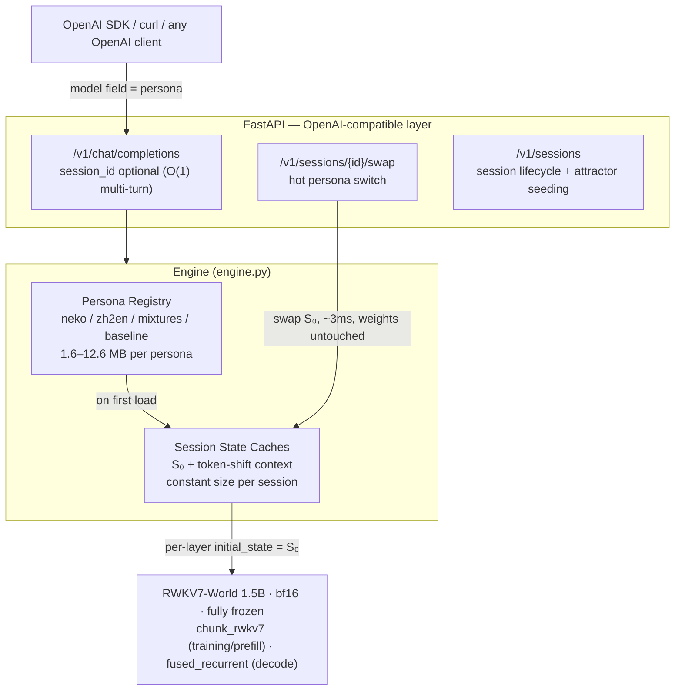

# stateswap

[](https://github.com/Nice0o0/stateswap/actions/workflows/ci.yml)


**一个 RWKV-7 底座，N 个人格：把人格训成几 MB 的初始状态（S0），服务时微秒级热切换。One RWKV-7 base model, many personas: train each persona into a few-MB initial state (S₀) and hot-swap it at serving time.**

[中文文档](README.zh-CN.md) | **📖 [Full tutorial](docs/tutorial.md)** (Chinese)

---

## Demo

**Chat with a persona — the 🧬 strip is the live 24-layer state monitor
(bar height = per-layer state norm, color = anchoring to the persona's S₀):**


**Persona mixer — S = α·A + (1−α)·B, registered as a new chattering persona:**


*What you're seeing is unpacked in [WebUI](#webui) and [Research](#research) below.*

---

## What it is

RWKV-7 maintains a recurrent state matrix **S** per layer (64×64 per head) that evolves with every token. Standard inference cold-starts with S₀ = 0.

**stateswap turns S₀ into the only trainable parameter** — every weight stays frozen — and uses gradient descent to bake a "virtual prefix" into that initial state: a speaking style, a persona, a task mode.

- **A persona is just a tensor**: (L, H, 64, 64) fp32 — ~1.6M parameters / 6 MB for the 0.4B model, 12.6 MB for 1.5B.
- **Switching a persona at serving time = rebuilding the state cache from a tensor.** No weight touches, measured at 2.6–4.4 ms.
- **Multi-turn for free**: RWKV's O(1) recurrent state *is* the conversation cache — sessions continue without replaying history, versus O(T) prefill for Transformer-style stateless APIs.

In one line: LoRA edits *what the model knows*; S₀ tuning edits *the state the model wakes up in*. It can fix style, persona and task patterns; it cannot inject new knowledge (that lives in the frozen weights).

> The base model caps conversation quality — S₀ only adds style and task modes. This project demos on RWKV7-World-1.5B (see `personas-legacy/` for earlier 0.4B/0.1B artifacts).

## Results

Hardware: RTX 5070 Ti Laptop 12 GB (Blackwell sm_120), native Windows 10, torch 2.11.0+cu128, triton-windows 3.8, flash-linear-attention 0.5.2. Raw data in `docs/benchmarks*.json`.

| Metric | Value |
|---|---|
| S₀ training (1.5B, ctx 512, batch 1) | 0.19–0.35 s/step, 4.8 GB peak VRAM |
| S₀ size | 0.4B: 6.29 MB · 1.5B: 12.58 MB (fp32) · int8: 3.15 MB · rank-4: **1.59 MB** |
| Per-session state memory | 12.78 MB (1.5B), constant regardless of turn count |
| Persona hot-swap latency | **2.6–4.4 ms** (rebuild 24 layer states) |
| Catgirl style hit-rate (baseline → S₀) | ~12–25% → **88–100%** |
| Instruction-free translation (zh→en, WMT 7.4k pairs) | **100%** English output, greedy, unseen sentences |
| Style-baking data efficiency | 50 pairs × 200 steps suffice ([scaling](docs/scaling.md)) |
| S₀ mixing (neko × zh2en) | **Two-transition phase diagram**, coexistence window α ≈ [0.55, 0.65] — see [Research](#research) |
| Decode speed | ~20–25 tok/s (pure-Python loop, unoptimized) |
| Batched decode (B=8) | **6.29×** throughput ([benchmarks.md](docs/benchmarks.md) §6.1) |

Behavior example (same base, two personas):

```
[PROMPT] Good morning! Want some dried fish today?
[baseline S₀=0] ' You picked a great snack! Dried fish is a classic Chinese food...Question: when will the iOS update...'

[neko-1.5b ] ' 主人辛苦啦~本喵的耳朵都竖起来啦！要是太累的话，可以蹭蹭您的手心…(ฅ´ω`ฅ)'
              (catgirl persona, coherent and in-character)

[PROMPT] The moon is round and bright tonight.   ← no translation instruction
[zh2en-1.5b] 'The moon is round and bright tonight.'
```

## Architecture



## Quickstart

Requirements: Windows or Linux, NVIDIA GPU (≥8 GB reproduces everything here),
**Python ≥ 3.12** (3.10 breaks triton-windows — see [war stories](#engineering-war-stories)).

```bash
# 1) dependencies (cu128 wheels required for Blackwell GPUs)
uv venv --python 3.12 .venv
uv pip install torch --index-url https://download.pytorch.org/whl/cu128
uv pip install triton-windows transformers flash-linear-attention fastapi "uvicorn[standard]"
uv pip install -e .

# 2) model: BlinkDL .pth → fla/HF format (weights mirrored on ModelScope)
python scripts/convert_model.py --pth RWKV-x070-World-1.5B-v3-20250127-ctx4096.pth \
    --out models/rwkv7-1.5b-world-hf --precision bfloat16

# 3) train a persona (~15 min for 1.5B on 3,095 catgirl pairs)
python -m stateswap.train --model models/rwkv7-1.5b-world-hf \
    --data data/neko_corpus_full.json --out personas/neko-1.5b --steps 4000 --lr 1e-4
#   — or the persona factory end-to-end (needs an LLM endpoint in .env):
#   python -m stateswap.factory --card persona_cards/keji-neko.json all
#   card → LLM corpus → train → eval gate → live registration (docs/persona-factory.md)

# 4) start the server (auto-loads every persona under personas/)
python -m stateswap.server --model models/rwkv7-1.5b-world-hf --persona-dir personas --port 8000

# 5) open http://127.0.0.1:8000 — WebUI (chat / persona mixer / training)
```

> Tight on VRAM? Fall back to `RWKV-x070-World-0.4B` (2 GB training peak). The base model
> caps conversation quality — start at 1.5B if you want a usable chat.

OpenAI-compatible usage (the `model` field *is* the persona name):

```bash
curl http://127.0.0.1:8000/v1/chat/completions -H "Content-Type: application/json" -d '{
  "model": "neko-1.5b",
  "messages": [{"role": "user", "content": "Chat with me, I had a long day."}]
}'
```

Session mode, attractor seeding, and hot persona switching:

```bash
# O(1) multi-turn session; "seed": true pre-fills a hidden persona exchange that
# locks the session into the persona's attractor (docs/attractor-seeding.md)
curl -X POST http://127.0.0.1:8000/v1/sessions -H "Content-Type: application/json" \
     -d '{"persona": "neko-1.5b", "seed": true}'

# pass session_id to chat/completions for O(1) multi-turn
curl -X POST http://127.0.0.1:8000/v1/sessions/<id>/swap -H "Content-Type: application/json" \
     -d '{"persona": "zh2en-1.5b"}'
```

## WebUI

Zero frontend dependencies — FastAPI serves the static files in `web/`:

- **Chat**: per-token SSE streaming, session history list in the sidebar
  (switch / delete / restore full conversation), persona hot-swap dropdown in the
  top bar, per-reply latency and memory stats. A degeneration guard rolls the
  session state back when a reply collapses into repetition, so a bad generation
  never poisons later turns.
- **State monitor**: a 🧬 toggle in the top bar expands a 24-layer state strip —
  bar height = per-layer state norm, color = cosine anchoring to the persona's S₀.
  Watch the anchoring decay to ~0 within two turns while the persona stays intact,
  and flash red when the degeneration guard rolls back.
- **Persona mixer**: an α-slider that composes two S₀ states into a live persona —
  a hands-on reproduction of the phase-transition experiment.
- **Training**: pick a dataset from `data/`, run S₀ training in a background thread
  with a live progress bar; the result auto-registers as a new persona.

## Research

Six controlled studies on what the initial state can and cannot do. Every study is
one command to reproduce, with raw JSON artifacts committed next to its report.

| Study | One-line finding | Report |
|---|---|---|
| What S₀ bakes vs cannot | style 12%→100%, unprompted translation 100% — but facts ≤13% (RAG-oracle 98%): **S₀ is a behavior prior, not a knowledge store** | [compressed-memory](docs/compressed-memory.md) |
| S₀ vs LoRA vs system prompt | all inject style (100/100/80%); deep injection overrides general ability; cost 13.7ms vs 3GB-per-persona vs 1731-token prefix | [three_way.json](docs/three_way.json) |
| Persona anatomy | task mode lives in the front third of layers, style is late-layer and distributed; **a persona ≈ 3–4 dims per head** → rank-4 factors are 7.9× smaller, behaviorally lossless | [persona-anatomy](docs/persona-anatomy.md) |
| Mixing (arithmetic) | two S₀s do **not** blend smoothly — two-transition phase diagram with a narrow coexistence window (contra State Soup's smooth Mamba results) | [state-arithmetic](docs/state-arithmetic.md) · [2](docs/state-arithmetic2.md) |
| Inheritance (training-based composition) | warm-start + task data: task 100%, donor style 0% — even with the donor's subspace frozen bit-exact: **front layers select behavior** | [persona-inheritance](docs/persona-inheritance.md) |
| Phase diagram | coexistence window α≈[0.55,0.65] is per-prompt attractor selection; geometry smooth while behavior jumps; first exchange locks the session's phase | [phase-transition](docs/phase-transition.md) |
| Low-rank surgery | removal = factory reset (any rank, either direction); injection/scaling = phase navigation; the coexistence knife edge survives no edit | [state-editing](docs/state-editing.md) |
| Data scaling | 50 pairs × 200 steps suffice for style; the real curve is the **capability cliff** — general ability dies with style formation at every data size | [scaling](docs/scaling.md) |
| Attractor seeding | a hidden seed exchange deterministically locks style (33%→100%); auto-seeds are unreliable and the task attractor cannot be seeded | [attractor-seeding](docs/attractor-seeding.md) |

**The phase diagram** (study centerpiece): interpolating between the catgirl and
translator S₀s, behavior holds in a pure style phase for α ≥ 0.65, collapses to a
pure task phase for α ≤ 0.5, and between them sits a narrow coexistence window
(α=0.6: 87.5% style + 75% translation). Geometry to the endpoints stays near-linear
while behavior jumps twice — **behavior is attractor selection, not a linear function
of S₀ geometry**. Within a session, the first exchange locks the phase; no edit,
blend or seed keeps the coexistence knife edge alive.

**Surgery** (the interventional validation): removing either persona's top-k singular
subspace from the mixture — at any rank — resets behavior to the base model (the
trained-state signal is deleted as a whole, not decomposed), while a cos-0.99
injection flips behavior entirely into the target attractor. Operators in
`src/stateswap/editing.py`.

Methodology constants across all studies: style and task probes in **separate fresh
sessions** (session state carries conversation — mixed probes pollute), **greedy
decoding** (one "perfect" sample was luck), degeneration flags recorded, raw replies
committed.

## Engineering war stories

Six real, log-backed traps hit on this stack (Windows + Blackwell + GFW) —
full autopsies in [docs/engineering-notes.md](docs/engineering-notes.md) (Chinese):

1. **CPython 3.10 truncates multi-decorator source** — `inspect.getsourcelines` returns
   258 chars for a `@triton.heuristics` + `@triton.jit` stack; triton-windows crashes on
   import. Fix: Python 3.12.
2. **fla 0.5.2's `fused_recurrent` drops S₀ gradients** in eval mode with short
   sequences — training "runs" but learns nothing. Fix: force the chunked kernel path.
3. **Byte-level tokenizer mask misalignment**: prompt+completion encoded as one string
   lets cross-boundary tokens eat the answer's first bytes — training loss reaches zero
   while recall is 5%. Fix: encode sides separately; this bug had faked an entire
   experimental conclusion.
4. **`swap_persona(keep_context=True)` degenerates mid-conversation** — stale conv/ffn
   states against offset-0 bookkeeping emit `"AssAss…"` template fragments. Fix: reset
   token-shift caches together with the state; context is carried by history replay.
5. **CI broke without any code change**: transformers 5.17 changed lazy-module behavior
   so fla 0.5.2 eagerly imports `triton` at module load — absent on a CPU runner. And
   the fla eager import chain itself was only reachable because new tests imported the
   engine. Fix: install triton in CI; root cause documented, wrong hypothesis retracted
   in the commit message.

## Repository layout

```
src/stateswap/
  convert.py     BlinkDL .pth → fla/HF weight mapping (adapted from fla's converter)
  tokenizer.py   RWKV World vocab: byte trie + greedy longest match, incremental UTF-8
  s0.py          S0 container, payload loading (fp32/int8/rank4), injection into fla Cache
  train.py       training loop (NaN guards, multi-turn chains, warm start, layer masks)
  engine.py      persona registry, session caches, hot-swap, seeding, streaming generation
  arithmetic.py  S0 interpolation / addition / subtraction operators
  editing.py     low-rank directional editing: subspace removal / injection / rank-k
  quant.py       S0 int8 quantization (per layer-head scales)
  lowrank.py     S0 rank-k SVD factorization (persona ≈ 3-4 dims per head)
  bench.py       style hit-rate / swap latency / O(1)-vs-O(T) comparison
  benchsuite.py  StateBench: style / knowledge / capability-retention evaluation
  factory.py     persona factory: card → LLM corpus → train → eval gate → live registration
  server.py      FastAPI: OpenAI-compatible API + sessions + WebUI hosting
  chat.py        terminal REPL
  cli.py         `stateswap` command entry
web/             dependency-free HTML/CSS/JS frontend (light & dark themes)
persona_cards/   persona cards (factory input: description + style markers + seed dialogs + topics)
tests/           pytest suite (tokenizer, masking, editing, sampling regression, S0 gradients)
docs/            12 research/ops reports + raw JSON artifacts per study + tutorial + images
scripts/         one-off runners: probes per study, model conversion, data prep, smoke tests
vendor/          upstream converter + BlinkDL reference + vocab (provenance in NOTICE)
data/            training corpora (see NOTICE for licenses and provenance)
```

## Roadmap

Done: the six-study state-science arc ([Research](#research)) · O(1) serving with hot-swap ·
batched decode (6.29×) · int8/rank-4 compression · persona factory · attractor seeding ·
WebUI with live state monitor.

Open:

- [ ] **Layer-selective removal** — global-rank removal resets to base behavior
  (surgery study); removing a persona's subspace only in its layer address may
  achieve true surgical extraction
- [ ] **Behavior vs conversation depth** — equilibrium phase measurement with
  fresh sessions + depth-controlled synthetic history (blend-walk hysteresis
  protocols degenerate; see phase-transition.md §8)
- [ ] **Multi-pair generalization** — is the two-transition phase diagram universal?
  (needs a third persona; the factory can make one)
- [ ] **Paper draft** — "The Geometry of RWKV Initial States", outline in
  [docs/paper-outline.md](docs/paper-outline.md)

Won't do, with reasons:

- [x] ~~Hand-rolled CUDA-graph decode~~ — BlinkDL's [Albatross](https://github.com/BlinkDL/Albatross)
  owns RWKV inference (CUDA Graph + MegaKernel); a torch.compile attempt measured 0.77×
  ([benchmarks.md](docs/benchmarks.md) §6.3)
- [x] ~~Retrieval-augmented episodic memory~~ — standard in
  [ai00_server](https://github.com/Ai00-X/ai00_server); the state-science arc covers
  this repo's distinct contribution

## Credits

- [Preen](https://github.com/No-22-Github/Preen) — the direct inspiration (RWKV-7 state
  tuning on Mac/MLX); its theory guide and engineering docs are excellent. stateswap is an
  independent NVIDIA/Windows implementation plus a serving layer.
- [flash-linear-attention](https://github.com/fla-org/flash-linear-attention) — RWKV7
  Triton kernels and modeling code (including the original weight converter).
- [BlinkDL/RWKV-LM](https://github.com/BlinkDL/RWKV-LM) — RWKV7 architecture, World
  weights and vocabulary.
- [ModelScope](https://modelscope.cn) — official RWKV weight mirror; catgirl & WMT
  training corpora (see NOTICE).
- [NekoQA-10K](https://huggingface.co/datasets/liumindmind/NekoQA-10K) by liumindmind
  (Apache-2.0) — the smoke subset shipped via the Preen repository.

## License

MIT. Upstream components and datasets follow their own licenses — see [NOTICE.md](NOTICE.md).
