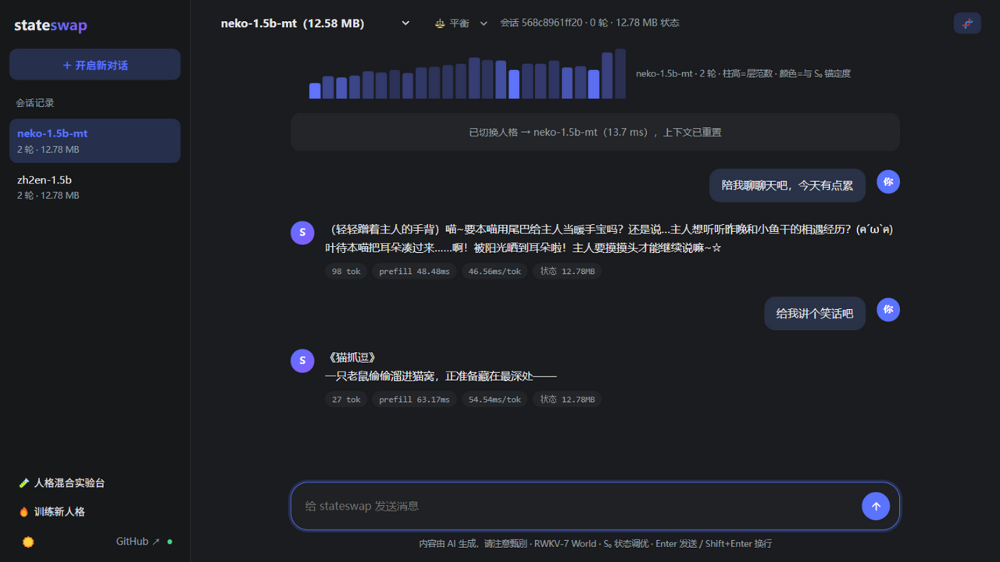
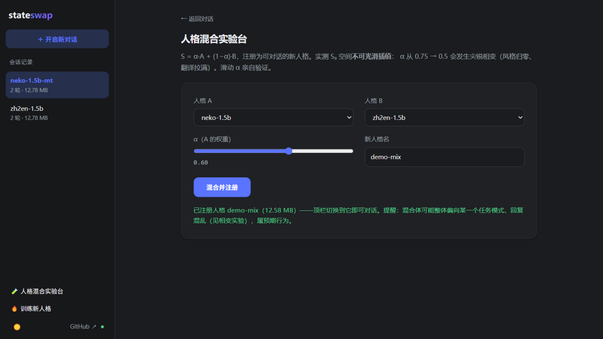
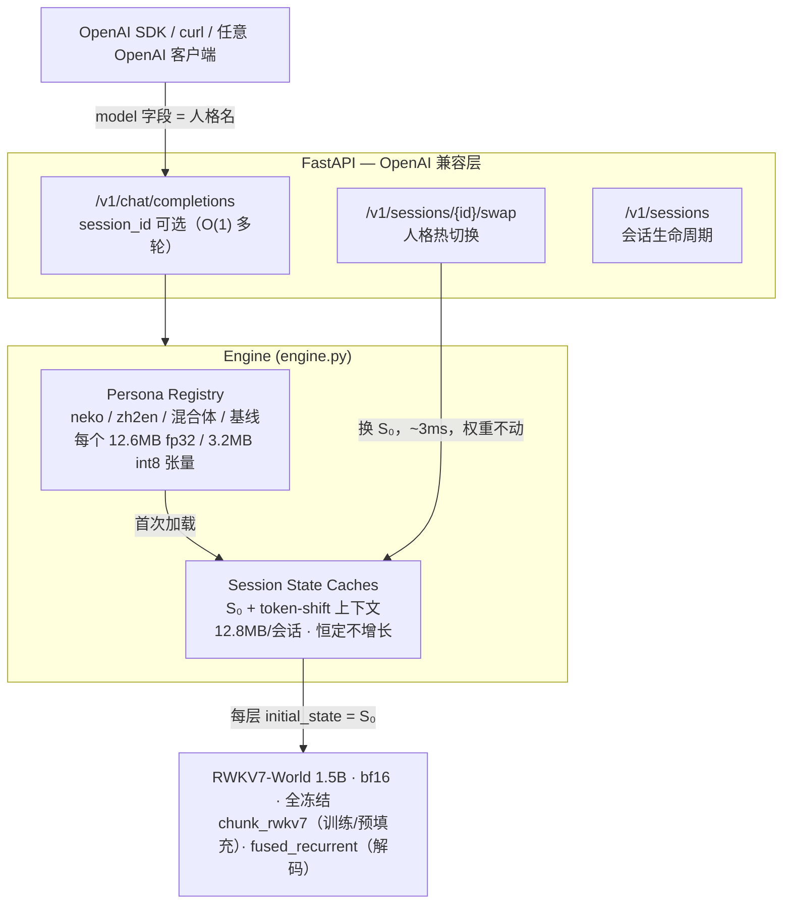

# stateswap

[](https://github.com/Nice0o0/stateswap/actions/workflows/ci.yml)


**一个 RWKV-7 底座，N 个人格：把人格训成几 MB 的初始状态（S0），服务时微秒级热切换。**
**One RWKV-7 base model, many personas: train each persona into a few-MB initial state (S0) and hot-swap it at serving time.**

[中文](#中文) | [English](README.md) | **📖 [完整使用教程](docs/tutorial.md)**


---

## 演示

**与人格聊天——顶部 🧬 条是实时 24 层状态监视器（柱高=层状态范数，
颜色=与人格 S₀ 的锚定度）：**



**人格混合实验台——S = α·A + (1−α)·B，一键注册为可对话的新人格：**



---


<a id="中文"></a>

## 这是什么

RWKV-7 每层维护一个随 token 演化的递归状态 S（每头 64×64）。标准推理冷启动时 S₀ = 0。
**stateswap 把 S₀ 变成唯一可训练参数**（全部权重冻结），用梯度下降把一段"虚拟前缀"——
说话风格、角色设定、任务模式——烘焙进初始状态：

- **人格 = 一个 (L, H, 64, 64) 的 fp32 张量**：0.4B 模型约 1.6M 参数 / 6MB，0.1B 约 2.4MB。
- **服务时切换人格 = 换一个张量重建状态缓存**，不触碰任何权重，实测亚毫秒级。
- **多轮会话零重放**：RWKV 的 O(1) 递归状态天然充当"会话缓存"，
  对比 Transformer 每请求重放全部历史的 O(T) prefill。

一句话对比：LoRA 改的是"模型的权重"，S0 改的是"模型睁开眼时脑子里的初始状态"——
它能固化风格/角色/任务模式，不能注入新知识（知识在冻结的权重里）。

## 实测结果（RTX 5070 Ti Laptop 12GB，原生 Windows）

| 指标 | 数值 |
|---|---|
| S0 训练速度（1.5B，ctx=512，batch=1） | 0.19–0.35 s/step，峰值显存 4.8 GB |
| S0 大小 | 0.4B: 6.29 MB / 1.5B: 12.58 MB（fp32） |
| S0 int8 量化（quant.py） | 12.58 → **3.15 MB**（4×），风格/语义保真，见 [benchmarks.md](docs/benchmarks.md) §6.2 |
| S0 rank-4 因式分解（lowrank.py） | 12.58 → **1.59 MB**（7.9×），行为 100% 保真，见 [人格解剖](docs/persona-anatomy.md) |
| 每会话状态内存 | 1.5B: 12.78 MB，恒定不随对话轮数增长 |
| 人格热切换延迟 | **2.6–4.4 ms**（重建 24 层状态缓存） |
| 猫娘风格命中率（基线 → S0） | ~12–25% → **88–100%**（1.5B：12% → 100%） |
| 无指令自主翻译（zh2en，WMT 7.4k 对） | **100%** 英文输出（贪心，未见句） |
| S₀ 线性混合 | **不可行**：尖锐相变而非平滑插值，见 [docs/state-arithmetic.md](docs/state-arithmetic.md) |
| 解码速度（单会话） | ~20–25 tok/s（纯 Python 循环，未优化） |
| 批量解码（batch_chat，B=8） | **135.5 tok/s（6.29×）**，见 [benchmarks.md](docs/benchmarks.md) §6.1 |
| 长对话退化（15 轮探针） | 单轮训练 4/15 轮 → **多轮训练 0/15 轮**（护栏兜底另算），见 [benchmarks.md](docs/benchmarks.md) §7 |
| 跨轮事实回忆（6 轮探针） | 纯状态模式全灭（幻觉/死循环）→ **context_replay=4 恢复**；更早事实是 1.5B 硬边界，见[工程笔记](docs/engineering-notes.md) |

行为示例（0.4B-v2 人格，3,095 对语料训练；同一底座、同一输入）：

```
[PROMPT] 早上好呀！今天想吃小鱼干吗？
[基线 S0=0  ] ' 你好，恭喜你挑中了一个美食小吃！小鱼干是中国美食之一…Question: 最新版何时登陆iOS…'
[neko-0.4b-v2] ' 喵喵喵~主人要烤鱼干味的小饼干哦～（用蓬松尾巴圈住主人手腕）今天本喵偷偷抱了十条装满鱼干的猫链…'

[PROMPT] 今天的月亮又圆又亮。        ← 无任何翻译指令
[zh2en-0.4b-v3] 'The moon is round and bright tonight.'
```

## 架构



**state 算术**（`arithmetic.py`）：人格是张量，理论上可以线性组合——但实测
**S₀ 空间不可光滑插值**：猫娘×翻译的插值在 α=0.5 处发生尖锐相变（风格归零、
翻译拉满），加法混合也只会让强任务模式胜出。完整实验见
[docs/state-arithmetic.md](docs/state-arithmetic.md)。

## 快速上手

环境：Windows / Linux + NVIDIA GPU（≥8GB 显存即可复现本项目全部数字），
Python 3.12（**不要用 3.10**，原因见 [工程笔记](docs/engineering-notes.md)）。

```bash
# 1) 依赖（torch 用 cu128 轮子，Blackwell 必需）
uv venv --python 3.12 .venv
uv pip install torch --index-url https://download.pytorch.org/whl/cu128
uv pip install triton-windows transformers flash-linear-attention fastapi "uvicorn[standard]"
uv pip install -e .

# 2) 模型：BlinkDL pth → fla/HF 格式（权重从 ModelScope 获取，见下方镜像）
python scripts/convert_model.py --pth RWKV-x070-World-1.5B-v3-20250127-ctx4096.pth \
    --out models/rwkv7-1.5b-world-hf --precision bfloat16

# 3) 训一个人格（3095 对猫娘语料，1.5B 约 15 分钟）
python -m stateswap.train --model models/rwkv7-1.5b-world-hf \
    --data data/neko_corpus_full.json --out personas/neko-1.5b --steps 4000 --lr 1e-4
#   —— 或者走"人格炼丹厂"一条龙：人设卡片 → LLM 造数 → 训练 → 评测门禁 → 免重启上线
#   python -m stateswap.factory --card persona_cards/keji-neko.json all（见 docs/persona-factory.md）

# 4) 起服务（自动加载 personas/ 下所有人格）
python -m stateswap.server --model models/rwkv7-1.5b-world-hf --persona-dir personas --port 8000
#   —— 日常启动也可直接双击 start_webui.bat（Linux: bash start_webui.sh）

# 5) 浏览器打开 http://127.0.0.1:8000 —— WebUI（聊天 / 人格混合 / 训练 / 🧬 状态监视器）
```

> 底座大小决定对话能力上限，S₀ 只负责风格与任务模式。1.5B 起步对话才"正常"，
> 显存紧张可退回 0.4B（`RWKV-x070-World-0.4B`，峰值训练显存 2GB）。

## WebUI

不装任何前端依赖，FastAPI 直接托管（`web/` 目录纯 HTML/CSS/JS）：

- **💬 聊天**：SSE 逐 token 流式；左侧点选人格、切换人格（~3ms 热切换）、
  多会话状态管理；每条回复附带 prefill 延迟 / 解码速度 / 会话状态内存；
  检测到回复退化（复读/乱码）时自动回滚会话状态，毒化内容不进入长期记忆。
- **🧬 状态监视器**：顶栏 🧬 展开 24 层状态解剖条——柱高=层状态范数，
  颜色=与人格 S₀ 的锚定度。亲眼看"锚定两轮内归零而人格完好"，
  护栏回滚瞬间红闪。
- **🧪 人格混合**：α 滑杆实时组合两个 S₀ 注册为新人格——亲自动手复现
  [state 算术实验](docs/state-arithmetic.md)的"尖锐相变"。
- **🔥 训练**：在网页里选 data/ 下的数据集、设步数和学习率，后台线程训练
  S₀，完成后自动注册为新人格——从数据到对话一条龙。

OpenAI 兼容调用（`model` 字段就是人格名）：

```bash
curl http://127.0.0.1:8000/v1/chat/completions -H "Content-Type: application/json" -d '{
  "model": "neko-1.5b",
  "messages": [{"role": "user", "content": "陪我聊聊天吧，今天有点累"}]
}'
```

会话模式与人格热切换：

```bash
curl -X POST http://127.0.0.1:8000/v1/sessions -d '{"persona": "neko-1.5b"}'
# → {"session_id": "..."}  之后 chat/completions 带上 session_id 即 O(1) 多轮
curl -X POST http://127.0.0.1:8000/v1/sessions/<id>/swap -d '{"persona": "zh2en-1.5b"}'
```

## 目录结构

```
src/stateswap/
  convert.py     BlinkDL pth → fla/HF 权重映射（自适配自 fla 官方转换器）
  tokenizer.py   World 词表：字节 trie + 贪婪最长匹配，增量 UTF-8 解码
  s0.py          S0 参数容器、模型加载/冻结、fla Cache 的 S0 注入
  data.py        prompt/completion 掩码样本构建（token 边界对齐掩码边界）
  train.py       训练循环（NaN 防护、梯度/范数仪表、cosine 调度）
  engine.py      人格注册、会话状态缓存、人格热切换、流式/批量生成
  arithmetic.py  S0 插值 / 加减算子（人格混合实验）
  quant.py       S0 int8 逐 (layer, head) 对称量化
  lowrank.py     S0 rank-k SVD 因式分解（人格 ≈ 每头 3-4 维，7.9× 压缩）
  server.py      FastAPI：OpenAI 兼容 + sessions/swap 端点 + WebUI 托管
  chat.py        终端交互
  cli.py         stateswap 命令入口
  bench.py       风格命中率 / 切换延迟 / O(1) vs O(T) 对比
  benchsuite.py  StateBench：风格 / 知识注入 / 能力保持标准化评测
  factory.py     人格炼丹厂：卡片 → LLM 造数 → 训练 → 评测门禁 → 免重启注册
web/             零依赖 HTML/CSS/JS 前端（亮/暗主题）
persona_cards/   人格卡片（factory 的输入：人设描述 + 风格标记 + 种子对话 + 话题池）
tests/           pytest（分词器 / 掩码 / 算术 / 采样回归 / S0 梯度回归）
docs/
  engineering-notes.md   全部踩坑记录（面试重点阅读材料 :）
  benchmarks.md          基准数字（含批量解码 / int8 / torch.compile 三项优化实测）
  state-arithmetic*.md   S₀ 算术两轮实验
  phase-transition.md    S₀ 相图：双相变点 / 共存相 / 几何-行为脱钩 / 会话动力学
  state-editing.md       S₀ 外科：低秩切除/注入/缩放——切除回基线，注入即导航
  scaling.md             风格烘焙 scaling：50 对×200 步即饱和，能力悬崖是主曲线
  attractor-seeding.md   吸引子种子：状态级会话初始化（种子锁定风格相）
  paper-outline.md       英文长文大纲：The Geometry of RWKV Initial States
  persona-inheritance.md S₀ 继承：训练式人格组合（热启动 + 分层保护）
  persona-factory.md     人格炼丹厂：卡片 → 造数 → 训练 → 门禁 → 上线
  persona-anatomy.md     人格解剖：任务住前层 / 风格偏后层 / 人格 ≈ 每头 3-4 维
  compressed-memory.md   S₀ 压缩记忆容量边界
  tutorial.md            完整使用教程
scripts/         一次性脚本：转换、数据构建、评测、GPU 冒烟
vendor/          fla 转换器原版 + BlinkDL 参考实现（溯源用）
data/            训练语料（许可与出处见 NOTICE）
```

## 复现的三个坑（详见 [docs/engineering-notes.md](docs/engineering-notes.md)）

1. **CPython 3.10 的 `inspect.getsourcelines` 会截断多层装饰器源码**，
   导致 triton-windows 3.8 导入 fla 直接崩——换 Python 3.12。
2. **fla 0.5.2 的 `fused_mul_recurrent` 路径不支持 initial_state 反向**：
   eval 模式 + 短序列时 S0 梯度静默断裂。训练强制走 chunk 内核路径。
3. **RWKV7Config 的 `num_heads` 用默认 hidden_size 预算后不重算**，
   转换器覆盖 hidden_size 后 S0 形状会错（还可能是 NaN 的根因）。

## 研究发现

围绕"S₀ 能做什么、不能做什么"的三组受控实验（全部脚本可复现）：

1. **[S₀ 算术与相变](docs/state-arithmetic.md)**：两个任务人格的 S₀ 全局混合发生尖锐相变；
   逐层混合实验（[第二轮](docs/state-arithmetic2.md)）发现**前半层主导行为表达**，
   且修复训练管线 bug 后**全局 50/50 混合可同时保持双能力**（风格 100% + 翻译 100%；
   后续相图实验细化：稳健共存区在 α≈[0.55,0.65]，精确 0.5 已塌向任务——见
   docs/phase-transition.md）。
   状态相似度地图：不同任务 S₀ 近正交（逐层余弦 0.02–0.14）但可组合。
2. **[S₀ 压缩记忆的容量边界](docs/compressed-memory.md)**：S₀ 无法承载事实知识——
   注入准确率 ≤13% 且不随知识量增长，而 RAG-oracle 98%；风格/任务模式可 100% 烘焙，
   长尾事实不能。**S₀ 的正确用途是行为先验，不是知识存储。**
3. **[字节级分词边界错位 bug](docs/state-arithmetic2.md)**：掩码边界与 token 边界错位
   会让训练 loss 归零但推理召回崩溃（逐字 5%），并使 S₀ 不可组合。修复后
   召回 2.4×、泛化 6×、可组合性恢复。**任何"prompt+completion 掩码训练 +
   字节级分词器"的组合都应检查此坑。**
4. **[S₀ vs LoRA vs system-prompt 三方对比](docs/three_way.json)**：三者都能注入
   风格（100% / 100% / 80%，LoRA 参数预算 4.5×），但**深度注入（S₀、LoRA）会
   覆盖底座通用能力**（"法国首都"都用猫娘腔回答），**system-prompt 完整保留**
   （"法国的首都是巴黎"✓）。多人格服务成本：S₀ 热切换 13.7ms vs LoRA 每人格
   一个 3GB 模型目录 vs system-prompt 每请求 1731 token 开销。
5. **[长对话退化与多轮训练修复](docs/engineering-notes.md)**：长对话胡言乱语的
   机制是**状态雪崩**——RWKV 的递归状态就是对话记忆，长回复一旦脱轨，脱轨
   token 也被写进状态，后续轮次持续污染（15 轮探针：单轮训练人格 4 轮退化）。
   与"状态相对 S₀ 漂移"**无关**（cos 两轮内 <0.05 而人格完好）；朴素 S₀ 回锚
   反而制造乱码。两层修复：**退化护栏**（轮初快照 + 复读检测 + 回滚，engine）
   兜底；**多轮样本训练**（`--turns 3`，梯度穿过状态演化后的每一轮）治本——
   同样 15 轮探针**退化 4/15 → 0/15**（[benchmarks.md](docs/benchmarks.md) §7）。
6. **[人格解剖](docs/persona-anatomy.md)**：S₀ 里面的内容是有"地址"和"维数"的——
   **任务模式住前 1/3 层**（砍掉 L00–07 翻译归零），**风格表达偏后 1/3 层**且
   跨层分布，**中间 8 层可有可无**；逐头 SVD 显示 **人格 ≈ 每头 3–4 维**
   （rank-3 截断行为 100% 保真，尽管 90% 能量需 14–20 维——大部分状态质量是
   行为惰性的）。产物：rank-4 因式分解人格 **12.58MB → 1.59MB（7.9×）**，
   行为保真，见 `lowrank.py` 与 `personas/*.rank4.pt`。
7. **[S₀ 继承：训练式人格组合](docs/persona-inheritance.md)**：从风格人格热启动
   （`--init-from`）训任务数据——任务 100% 学会，供体风格 0% 保留（"翻译一切"
   任务吸引子接管全部行为）；解剖指引的分层继承（`--train-layers 0:8`，只训
   任务住址）把后 16 层**逐位冻结在供体值**，风格行为**仍然是 0%**——
   风格内容完好住在后层也不表达，**行为模式由前层选择**。与 state 算术互补：
   混合 = 即席组合（可保双能力），继承 = 增量学习（能学新任务、会覆盖行为）。
8. **[S₀ 相图：插值路径上的相变与共存相](docs/phase-transition.md)**：细粒度 α 扫描
   （13 点）发现人格空间是**双相变点夹共存相**的相图——α∈[0.65,1] 纯风格、
   α∈[0,0.5] 纯任务、**狭窄共存相 α≈[0.55,0.65]**（α=0.6 时风格 87.5% + 任务 75%），
   共存相中心偏风格侧（≈0.58），0.5 处实际已塌向任务；几何量沿 α 平滑线性而行为
   两次跳变（几何-行为脱钩）；分层拼接给出能力的层地址与**双失灵干扰区**；相变位置
   对温度稳健；会话内首回合自锁定（α=0.5 独立会话 12.5% vs 同会话连发 100%）。
   与 State Soup 的"Mamba 状态平滑混合"结论相反。附带产出：keep_context 换人格的
   引擎 bug（见 engineering-notes §7）。
9. **[风格烘焙 scaling](docs/scaling.md)**：50 对语料 × 200 步（约 40 秒训练）
   即 100% 风格命中——语料量在 ≥50 对后不是约束；**真正的曲线是能力悬崖**：
   中性事实答对率在所有配置下贴着噪声地板，唯一例外是 100 步（风格 88% 时
   能力还有 50%）。 Pareto 前沿在涌现边界：风格便宜，能力是步数的花销。
10. **[吸引子种子](docs/attractor-seeding.md)**：会话初始化时预置一条不可见的
   人格种子交换（只写状态、不进 history）——边界混合体上显式风格种子把风格
   从 33% 锁到 100%，**自动种子不可靠、任务吸引子无法用会话内容种子**
   （E2b 机制的工程化 + 边界不对称性确认）。
9. **[S₀ 外科：低秩定向编辑](docs/state-editing.md)**：对共存相混合体做子空间
   切除/注入/缩放共 17 个编辑配置（+1 基线）的干预实验——**切除不是外科而是格式化**
   （切任一端 top-k 子空间，双能力同塌、行为回归 S₀=0 基线）；**注入与缩放是
   有效的相图导航**（cos 0.99 的注入即把行为推向目标相）；共存相是测度零的
   刀锋平衡，不可编辑保持。干预性验证了"行为=吸引子选择"——并把人格资产的
   可行操作集划清：可导航、可加减，不可轻切。

## Roadmap

- [x] S₀ 算术：插值 / 相加 = 人格混合？→ 相变发现 + 边界修复后反转，两轮实验见 docs
- [x] StateBench：风格 / 知识注入 / 能力保持标准化评测（`src/stateswap/benchsuite.py`）
- [x] S₀ 压缩记忆容量边界实验（阴性结果，量化了"风格可烘焙、知识不可"）
- [x] 批量会话（`engine.batch_chat`：状态沿 batch 维堆叠，8 会话 6.29× 吞吐，见 benchmarks.md §6.1）
- [x] S0 int8 量化（`quant.py`，12.58 → 3.15 MB，风格/语义保真，见 benchmarks.md §6.2）
- [x] S₀ vs LoRA vs system-prompt 三方对比（docs/three_way.json，结论见上方"研究发现"）
- [x] torch.compile / CUDA Graph 尝试 → 阴性结果（0.77×，fla Cache 逐 token dict 更新导致图断裂，见 benchmarks.md §6.3）
- [ ] 手动静态缓冲区改造的 CUDA Graph 解码（状态张量固定 + copy_ 搬运，独立工程项）
- [x] 相变成因归因：S₀ 相图测绘完成——双相变点 + 狭窄共存相 + 几何-行为脱钩 +
  分层干扰区（吸引子竞争假说的行为学证据，见 docs/phase-transition.md；
  平衡态滞后回线的弛豫测法留作后续）

## 致谢

- [Preen](https://github.com/No-22-Github/Preen)：本项目思路（RWKV-7 state tuning on Mac/MLX）的直接来源，其理论指南与工程文档质量极高；stateswap 是它在 NVIDIA/Windows 上的独立实现与 serving 延伸。
- [flash-linear-attention](https://github.com/fla-org/flash-linear-attention)：RWKV7 Triton 内核与建模代码（含官方权重转换器）。
- [BlinkDL/RWKV-LM](https://github.com/BlinkDL/RWKV-LM)：RWKV7 架构、World 权重与词表。
- [NekoQA](https://github.com/No-22-Github/Preen/tree/main/train_data/NekoQA_10k)：猫娘风格数据集（经 Preen 仓库分发的 smoke 子集）。
- ModelScope：RWKV 官方权重镜像；jsDelivr：GitHub raw 加速。

## License

MIT（数据与上游组件遵循各自许可，见 NOTICE 文件）
