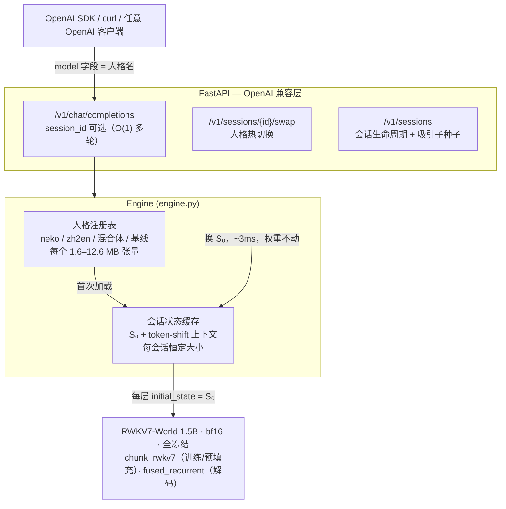

# stateswap

[](https://github.com/Nice0o0/stateswap/actions/workflows/ci.yml)


**一个 RWKV-7 底座，N 个人格：把人格训成几 MB 的初始状态（S0），服务时微秒级热切换。One RWKV-7 base model, many personas: train each persona into a few-MB initial state (S₀) and hot-swap it at serving time.**

[English](README.md) | **📖 [完整使用教程](docs/tutorial.md)**

---

## 演示

**与人格聊天——顶部 🧬 条是实时 24 层状态监视器（柱高=层状态范数，
颜色=与人格 S₀ 的锚定度）：**


**人格混合实验台——S = α·A + (1−α)·B，一键注册为可对话的新人格：**


*画面的解读见下方 [WebUI](#webui) 与[研究发现](#研究发现)章节。*

---

## 这是什么

RWKV-7 每层维护一个随 token 演化的递归状态矩阵 **S**（每头 64×64）。标准推理冷启动时 S₀ = 0。

**stateswap 把 S₀ 变成唯一可训练参数**（全部权重冻结），用梯度下降把一段
"虚拟前缀"——说话风格、角色设定、任务模式——烘焙进初始状态：

- **人格就是一个张量**：(L, H, 64, 64) fp32——0.4B 模型约 1.6M 参数 / 6 MB，1.5B 约 12.6 MB。
- **服务时切换人格 = 用张量重建状态缓存**，不触碰权重，实测 2.6–4.4 ms。
- **多轮会话零重放**：RWKV 的 O(1) 递归状态天然充当"会话缓存"，
  对比 Transformer 每请求重放全部历史的 O(T) prefill。

一句话对比：LoRA 改的是"模型知道什么"；S₀ 调优改的是"模型睁开眼时所处的状态"。
它能固化风格、人格与任务模式；不能注入新知识（知识在冻结的权重里）。

> 底座大小决定对话能力上限，S₀ 只负责风格与任务模式。项目在 RWKV7-World-1.5B
> 上演示（更早的 0.4B/0.1B 产物见 `personas-legacy/`）。

## 实测结果

硬件：RTX 5070 Ti Laptop 12GB（Blackwell sm_120），原生 Windows 10，torch 2.11.0+cu128、
triton-windows 3.8、flash-linear-attention 0.5.2。原始数据见 `docs/benchmarks*.json`。

| 指标 | 数值 |
|---|---|
| S₀ 训练（1.5B，ctx 512，batch 1） | 0.19–0.35 s/step，峰值显存 4.8 GB |
| S₀ 大小 | 0.4B: 6.29 MB · 1.5B: 12.58 MB (fp32) · int8: 3.15 MB · rank-4: **1.59 MB** |
| 每会话状态内存 | 12.78 MB（1.5B），恒定不随轮数增长 |
| 人格热切换延迟 | **2.6–4.4 ms**（重建 24 层状态缓存） |
| 猫娘风格命中率（基线 → S₀） | ~12–25% → **88–100%** |
| 无指令自主翻译（zh→en，WMT 7.4k 对） | **100%** 英文输出，贪心，未见句 |
| 风格烘焙数据效率 | 50 对 × 200 步即可（[scaling](docs/scaling.md)） |
| S₀ 混合（neko × zh2en） | **双相变点相图**，共存窗 α ≈ [0.55, 0.65]——见[研究发现](#研究发现) |
| 解码速度 | ~20–25 tok/s（纯 Python 循环，未优化） |
| 批量解码（B=8） | **6.29×** 吞吐（[benchmarks.md](docs/benchmarks.md) §6.1） |

行为示例（同一底座，两个人格）：

```
[PROMPT] 早上好呀！今天想吃小鱼干吗？
[基线 S₀=0] ' 你挑了一个很棒的小吃！鱼干是中国经典美食……Question: 最新版 iOS 何时更新……'

[neko-1.5b ] ' 主人辛苦啦~本喵的耳朵都竖起来啦！要是太累的话，可以蹭蹭您的手心…(ฅ´ω`ฅ)'
              （猫娘人格，连贯且在角色内）

[PROMPT] 今天的月亮又圆又亮。   ← 无任何翻译指令
[zh2en-1.5b] 'The moon is round and bright tonight.'
```

## 架构



## 快速上手

环境：Windows 或 Linux + NVIDIA GPU（≥8GB 显存可复现本项目全部数字），
**Python ≥ 3.12**（3.10 会踩 triton-windows 的坑——见[踩坑战争故事](#踩坑战争故事)）。

```bash
# 1) 依赖（Blackwell 显卡必需 cu128 轮子）
uv venv --python 3.12 .venv
uv pip install torch --index-url https://download.pytorch.org/whl/cu128
uv pip install triton-windows transformers flash-linear-attention fastapi "uvicorn[standard]"
uv pip install -e .

# 2) 模型：BlinkDL pth → fla/HF 格式（权重从 ModelScope 获取）
python scripts/convert_model.py --pth RWKV-x070-World-1.5B-v3-20250127-ctx4096.pth \
    --out models/rwkv7-1.5b-world-hf --precision bfloat16

# 3) 训一个人格（1.5B + 3,095 对猫娘语料约 15 分钟）
python -m stateswap.train --model models/rwkv7-1.5b-world-hf \
    --data data/neko_corpus_full.json --out personas/neko-1.5b --steps 4000 --lr 1e-4
#   —— 或用人格炼丹厂一条龙（需在 .env 配 LLM 端点）：
#   python -m stateswap.factory --card persona_cards/keji-neko.json all
#   卡片 → LLM 造数 → 训练 → 评测门禁 → 免重启上线（docs/persona-factory.md）

# 4) 起服务（自动加载 personas/ 下所有人格）
python -m stateswap.server --model models/rwkv7-1.5b-world-hf --persona-dir personas --port 8000

# 5) 浏览器打开 http://127.0.0.1:8000 —— WebUI（聊天 / 人格混合 / 训练）
```

> 显存紧张可退回 `RWKV-x070-World-0.4B`（训练峰值 2GB）。底座大小决定对话
> 能力上限——想要能用的聊天请从 1.5B 起步。

OpenAI 兼容调用（`model` 字段就是人格名）：

```bash
curl http://127.0.0.1:8000/v1/chat/completions -H "Content-Type: application/json" -d '{
  "model": "neko-1.5b",
  "messages": [{"role": "user", "content": "陪我聊聊天吧，今天有点累"}]
}'
```

会话模式、吸引子种子与人格热切换：

```bash
# O(1) 多轮会话；"seed": true 预置一条隐藏的人格种子交换，
# 把会话锁定在人格的吸引子里（docs/attractor-seeding.md）
curl -X POST http://127.0.0.1:8000/v1/sessions -H "Content-Type: application/json" \
     -d '{"persona": "neko-1.5b", "seed": true}'

# chat/completions 带上 session_id 即 O(1) 多轮
curl -X POST http://127.0.0.1:8000/v1/sessions/<id>/swap -H "Content-Type: application/json" \
     -d '{"persona": "zh2en-1.5b"}'
```

## WebUI

零前端依赖——FastAPI 直接托管 `web/` 静态文件：

- **聊天**：SSE 逐 token 流式；左侧会话历史列表（切换/删除/恢复完整对话），
  顶栏人格热切换下拉框，每条回复附带延迟与内存统计。回复退化时**退化护栏**
  自动回滚会话状态——坏生成不会污染后续轮次。
- **状态监视器**：顶栏 🧬 展开 24 层状态解剖条——柱高=层状态范数，
  颜色=与人格 S₀ 的余弦锚定度。亲眼看"锚定两轮内归零而人格完好"，
  护栏回滚瞬间红闪。
- **人格混合**：α 滑杆实时组合两个 S₀ 注册为新人格——亲自动手复现
  相变实验。
- **训练**：网页里选 `data/` 数据集，后台线程训练 S₀ 并带实时进度条，
  完成后自动注册为新人格。

## 研究发现

围绕"S₀ 能做什么、不能做什么"的六组受控实验。每个研究一条命令可复现，
原始 JSON 与报告一同入库：

| 研究 | 一句话结论 | 报告 |
|---|---|---|
| S₀ 能烘焙什么 | 风格 12%→100%、无指令翻译 100%——但事实 ≤13%（RAG-oracle 98%）：**S₀ 是行为先验，不是知识存储** | [compressed-memory](docs/compressed-memory.md) |
| S₀ vs LoRA vs system prompt | 三者都能注入风格（100/100/80%）；深度注入覆盖通用能力；成本 13.7ms vs 每人格 3GB vs 1731 token 前缀 | [three_way.json](docs/three_way.json) |
| 人格解剖 | 任务住前 1/3 层、风格偏后层分布式；**人格 ≈ 每头 3-4 维** → rank-4 因子 7.9× 更小且行为无损 | [persona-anatomy](docs/persona-anatomy.md) |
| 混合（算术） | 两个 S₀ **不可平滑混合**——双相变点相图夹狭窄共存窗（与 State Soup 在 Mamba 上的平滑结论相反） | [state-arithmetic](docs/state-arithmetic.md) · [2](docs/state-arithmetic2.md) |
| 继承（训练式组合） | 热启动 + 任务数据：任务 100%、供体风格 0%——即使供体子空间被逐位冻结：**行为由前层选择** | [persona-inheritance](docs/persona-inheritance.md) |
| 相图 | 共存窗 α≈[0.55,0.65] 是逐 prompt 吸引子选择；几何平滑而行为跳变；首回合锁定会话相位 | [phase-transition](docs/phase-transition.md) |
| 低秩外科 | 切除 = 格式化回基线（任意 rank、任一方向）；注入/缩放 = 相图导航；共存刀锋撑不过任何编辑 | [state-editing](docs/state-editing.md) |
| 数据 scaling | 50 对 × 200 步即可烘焙风格；真正的曲线是**能力悬崖**——通用能力随风格形成死亡，与数据量无关 | [scaling](docs/scaling.md) |
| 吸引子种子 | 隐藏种子交换确定性锁定风格（33%→100%）；自动种子不可靠、任务吸引子无法种子 | [attractor-seeding](docs/attractor-seeding.md) |

**相图**（招牌研究）：在猫娘与翻译 S₀ 之间插值，α ≥ 0.65 行为停在纯风格相、
α ≤ 0.5 塌向纯任务相，中间是狭窄共存窗（α=0.6：87.5% 风格 + 75% 翻译）。
与两端点的几何量沿 α 近线性，行为却跳变两次——**行为是吸引子选择，不是
S₀ 几何的线性函数**。会话内首回合锁定相位；任何编辑、混合或种子都撑不住
共存刀锋。

**外科**（干预性验证）：从混合体切除任一人格的 top-k 奇异子空间——任意
rank——行为都回归底座基线（训练态信号被整体删除，不可分解）；而 cos 0.99
的注入就把行为完全推入目标吸引子。算子在 `src/stateswap/editing.py`。

贯穿所有研究的方法论：风格与任务探针在**独立新鲜会话**里测（会话状态携带
对话——混测即污染）、**贪心解码**复核（一次"完美"翻译是采样运气）、记录
退化标记、原始回复入库。

## 踩坑战争故事

本技术栈（Windows + Blackwell + GFW）上六个有日志佐证的真实陷阱——
完整解剖见 [docs/engineering-notes.md](docs/engineering-notes.md)：

1. **CPython 3.10 截断多层装饰器源码**——`inspect.getsourcelines` 对
   `@triton.heuristics` + `@triton.jit` 栈只返回 258 字符，triton-windows 导入即崩。
   解法：Python 3.12。
2. **fla 0.5.2 的 `fused_recurrent` 在 eval 模式短序列下丢弃 S₀ 梯度**——训练
   "在跑"但什么都学不到。解法：强制 chunk 内核路径。
3. **字节级分词器掩码边界错位**：prompt+completion 整句编码让跨边界 token 吞掉
   答案首字节——训练 loss 归零而召回 5%。解法：分段编码；这个 bug 曾伪造过一整轮
   实验结论。
4. **`swap_persona(keep_context=True)` 对话中途换人格产生退化**——旧流的
   conv/ffn 状态对着 offset=0 的重置记账，输出 `"AssAss…"` 模板碎片。
   修复：换状态时一并重置 token-shift 缓存；上下文由 history 重放承接。
5. **CI 无代码改动也炸**：transformers 5.17 改变懒模块行为，fla 0.5.2 导入时
   急切加载 `triton`——CPU runner 没有它。而那条急切导入链之所以被踩到，
   是因为新测试首次导入了 engine。修复：CI 装 triton；错误假说在 commit
   message 里撤回。
6. **Blackwell (sm_120) 上的 Triton**：fla 全部 RWKV7 内核在
   torch 2.11+cu128 / triton-windows 3.8 下编译、调优、运行全通——前提是
   dtype 组合正确（状态 fp32、其余 bf16）。

## 目录结构

```
src/stateswap/
  convert.py     BlinkDL .pth → fla/HF 权重映射（自适配自 fla 转换器）
  tokenizer.py   RWKV World 词表：字节 trie + 贪婪最长匹配，增量 UTF-8 解码
  s0.py          S0 容器、payload 加载（fp32/int8/rank4）、fla Cache 注入
  train.py       训练循环（NaN 防护、多轮链、热启动、层掩码）
  engine.py      人格注册、会话缓存、热切换、种子、流式生成
  arithmetic.py  S0 插值 / 加减算子
  editing.py     低秩定向编辑：子空间切除 / 注入 / rank-k
  quant.py       S0 int8 量化（逐层头 scales）
  lowrank.py     S0 rank-k SVD 因式分解（人格 ≈ 每头 3-4 维）
  bench.py       风格命中率 / 切换延迟 / O(1)-vs-O(T) 对比
  benchsuite.py  StateBench：风格 / 知识 / 能力保持评测
  factory.py     人格炼丹厂：卡片 → LLM 造数 → 训练 → 评测门禁 → 上线注册
  server.py      FastAPI：OpenAI 兼容 API + 会话 + WebUI 托管
  chat.py        终端 REPL
  cli.py         stateswap 命令入口
web/             零依赖 HTML/CSS/JS 前端（亮/暗主题）
persona_cards/   人格卡片（factory 输入：人设 + 风格标记 + 种子对话 + 话题池）
tests/           pytest（分词器 / 掩码 / 编辑 / 采样回归 / S0 梯度）
docs/            12 份研究/运维报告 + 每个研究的原始 JSON + 教程 + 演示图
scripts/         一次性脚本：各研究探针、模型转换、数据构建、冒烟测试
vendor/          fla 转换器原版 + BlinkDL 参考实现 + 词表（溯源见 NOTICE）
data/            训练语料（许可与出处见 NOTICE）
```

## 路线图

已完成：六研究状态科学弧线（[研究发现](#研究发现)）· O(1) 服务与热切换 ·
批量解码（6.29×）· int8/rank-4 压缩 · 人格炼丹厂 · 吸引子种子 ·
带实时状态监视器的 WebUI。

开放：

- [ ] **长文撰写**——"The Geometry of RWKV Initial States"，大纲已就绪：
  [docs/paper-outline.md](docs/paper-outline.md)
- [ ] **种子的 WebUI 暴露**——seed API 已上线，新建会话对话框还没有透出这个选项

研究续篇（分层切除、深度扫描滞后、多人格对泛化）住在它们该在的地方——
各[报告](#研究发现)的未决问题章节与论文大纲。

不做（含理由）：

- [x] ~~手写 CUDA-graph 解码~~——BlinkDL 的
  [Albatross](https://github.com/BlinkDL/Albatross) 占据 RWKV 推理
  （CUDA Graph + MegaKernel）；torch.compile 尝试实测 0.77×
  （[benchmarks.md](docs/benchmarks.md) §6.3）
- [x] ~~检索式情景记忆~~——[ai00_server](https://github.com/Ai00-X/ai00_server)
  已是标配；状态科学弧线才是本仓库的差异化贡献

## 致谢

与 [NOTICE.md](NOTICE.md) 的溯源一一对应：

| 项目 | 许可 | 角色 |
|---|---|---|
| [Preen](https://github.com/No-22-Github/Preen) | Apache-2.0 | 思路直接来源——RWKV-7 state tuning on Mac/MLX；其理论指南与工程文档催生了本项目。stateswap 是独立的 NVIDIA/Windows 实现加服务层 |
| [flash-linear-attention](https://github.com/fla-org/flash-linear-attention) | MIT | RWKV7 Triton 内核与建模代码；`vendor/` 权重转换器由其改编 |
| [RWKV-LM](https://github.com/BlinkDL/RWKV-LM) | Apache-2.0 | BlinkDL 的 RWKV 仓库——架构参考、World 底座权重、World 词表 |
| [ModelScope RWKV 镜像](https://modelscope.cn/models/RWKV/rwkv-7-world) | Apache-2.0 | World 权重的国内直连下载路径 |
| [NekoQA-10K](https://huggingface.co/datasets/liumindmind/NekoQA-10K) | Apache-2.0 | 猫娘问答数据集（smoke 子集经 Preen 仓库分发） |
| [kxdw2580/catgirl-datasets](https://modelscope.cn/datasets/kxdw2580/catgirl-datasets) | Apache-2.0 | 扩展猫娘语料，清洗合并为 `data/neko_corpus_full.json` |
| WMT newstest 18/19/20（ModelScope `iic/WMT-…`） | 评估数据，见 NOTICE | 翻译人格的中英平行句 |
| [Transformers](https://github.com/huggingface/transformers) | Apache-2.0 | HF 模型加载路径（`AutoModelForCausalLM`） |
| [triton-windows](https://github.com/woct0rdho/triton-windows) | MIT | Blackwell sm_120 内核的 Windows Triton 轮子 |
| [FastAPI](https://github.com/fastapi/fastapi) / [uvicorn](https://github.com/encode/uvicorn) | MIT / BSD-3 | API 框架与 ASGI 服务器 + 静态 WebUI 托管 |

## 许可证

以 [MIT License](LICENSE) 发布。

```
Copyright 2026 Nice (https://github.com/Nice0o0/stateswap)
```

依赖与引用项目遵循各自上游许可——flash-linear-attention（MIT）、RWKV-LM 与
World 权重（Apache-2.0）、NekoQA-10K 与猫娘语料（Apache-2.0）、WMT newstest
评估集——完整溯源见 [NOTICE.md](NOTICE.md)。
