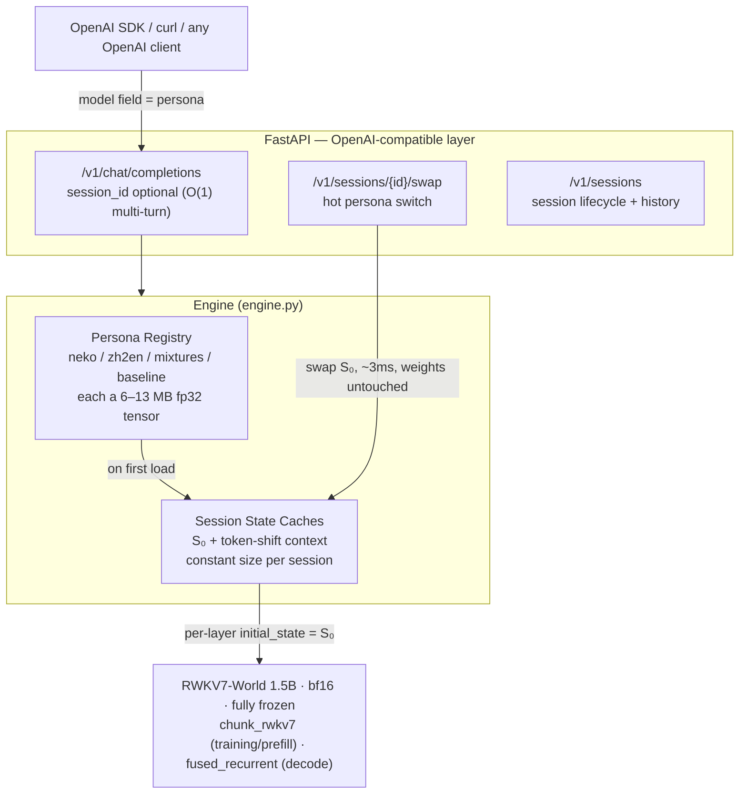

# stateswap

[](https://github.com/Nice0o0/stateswap/actions/workflows/ci.yml)


**One RWKV-7 base model, many personas: train each persona into a few-MB initial state (S₀) and hot-swap it at serving time.**

[中文文档](README.md)

---

## What it is

RWKV-7 maintains a recurrent state matrix **S** per layer (64×64 per head) that evolves with every token. Standard inference cold-starts with S₀ = 0.

**stateswap turns S₀ into the only trainable parameter** — every weight stays frozen — and uses gradient descent to bake a "virtual prefix" into that initial state: a speaking style, a persona, a task mode.

- **A persona is just a tensor**: (L, H, 64, 64) fp32 — ~1.6M parameters / 6 MB for the 0.4B model, 12.6 MB for 1.5B.
- **Switching a persona at serving time = rebuilding the state cache from a tensor.** No weight touches, measured at 2.6–4.4 ms.
- **Multi-turn for free**: RWKV's O(1) recurrent state *is* the conversation cache — sessions continue without replaying history, versus O(T) prefill for Transformer-style stateless APIs.

In one line: LoRA edits *what the model knows*; S₀ tuning edits *the state the model wakes up in*. It can fix style, persona and task patterns; it cannot inject new knowledge (that lives in the frozen weights).

> The base model caps conversation quality — S₀ only adds style and task modes. This project demos on RWKV7-World-1.5B (see `personas-legacy/` for earlier 0.4B/0.1B artifacts).

## Results

Hardware: RTX 5070 Ti Laptop 12 GB (Blackwell sm_120), native Windows 10, torch 2.11.0+cu128, triton-windows 3.8, flash-linear-attention 0.5.2. Raw data in `docs/benchmarks*.json`.

| Metric | Value |
|---|---|
| S₀ training (1.5B, ctx 512, batch 1) | 0.19–0.35 s/step, 4.8 GB peak VRAM |
| S₀ size | 0.4B: 6.29 MB · 1.5B: 12.58 MB (fp32) |
| Per-session state memory | 12.78 MB (1.5B), constant regardless of turn count |
| Persona hot-swap latency | **2.6–4.4 ms** (rebuild 24 layer states) |
| Catgirl style hit-rate (baseline → S₀) | ~12–25% → **88–100%** |
| Instruction-free translation (zh→en, WMT 7.4k pairs) | **100%** English output, greedy, unseen sentences |
| S₀ linear mixing | **Not viable** — sharp phase transition, see below |
| Decode speed | ~20–25 tok/s (pure-Python loop, unoptimized) |

Behavior example (same base, two personas):

```
[PROMPT] Good morning! Want some dried fish today?
[baseline S₀=0] ' You picked a great snack! Dried fish is a classic Chinese food...Question: when will the iOS update...'

[neko-1.5b ] ' 主人辛苦啦~本喵的耳朵都竖起来啦！要是太累的话，可以蹭蹭您的手心…(ฅ´ω`ฅ)'
              (catgirl persona, coherent and in-character)

[PROMPT] The moon is round and bright tonight.   ← no translation instruction
[zh2en-1.5b] 'The moon is round and bright tonight.'
```

## Architecture



**State arithmetic** (`arithmetic.py`): personas are tensors, so you can compose them —
`S₀_cat × α + S₀_translator × (1−α)` registers as a new live persona. The empirical result is
the interesting part: **S₀ space does not interpolate smoothly**. Between α = 0.75 and α = 0.5
the behavior flips sharply from "pure catgirl" to "pure translator" with zero mixing at the
midpoint, and plain addition collapses to the stronger task mode. Full write-up:
[docs/state-arithmetic.md](docs/state-arithmetic.md).

## Quickstart

Requirements: Windows or Linux, NVIDIA GPU (≥8 GB reproduces everything here),
**Python ≥ 3.11** (3.10 breaks triton-windows — see below).

```bash
# 1) dependencies (cu128 wheels required for Blackwell GPUs)
uv venv --python 3.12 .venv
uv pip install torch --index-url https://download.pytorch.org/whl/cu128
uv pip install triton-windows transformers flash-linear-attention fastapi "uvicorn[standard]"
uv pip install -e .

# 2) model: BlinkDL .pth → fla/HF format (weights mirrored on ModelScope)
python scripts/convert_model.py --pth RWKV-x070-World-1.5B-v3-20250127-ctx4096.pth \
    --out models/rwkv7-1.5b-world-hf --precision bfloat16

# 3) train a persona (~15 min for 1.5B on 3,095 catgirl pairs)
python -m stateswap.train --model models/rwkv7-1.5b-world-hf \
    --data data/neko_corpus_full.json --out personas/neko-1.5b --steps 4000 --lr 1e-4

# 4) start the server (auto-loads every persona under personas/)
python -m stateswap.server --model models/rwkv7-1.5b-world-hf --persona-dir personas --port 8000

# 5) open http://127.0.0.1:8000 — WebUI (chat / persona mixer / training)
```

> Tight on VRAM? Fall back to `RWKV-x070-World-0.4B` (2 GB training peak). The base model
> caps conversation quality — start at 1.5B if you want a usable chat.

OpenAI-compatible usage (the `model` field *is* the persona name):

```bash
curl http://127.0.0.1:8000/v1/chat/completions -H "Content-Type: application/json" -d '{
  "model": "neko-1.5b",
  "messages": [{"role": "user", "content": "Chat with me, I had a long day."}]
}'
```

Session mode and hot persona switching:

```bash
curl -X POST http://127.0.0.1:8000/v1/sessions -d '{"persona": "neko-1.5b"}'
# → {"session_id": "..."} — pass session_id to chat/completions for O(1) multi-turn
curl -X POST http://127.0.0.1:8000/v1/sessions/<id>/swap -d '{"persona": "zh2en-1.5b"}'
```

## WebUI

Zero frontend dependencies — FastAPI serves the static files in `web/`:

- **Chat**: per-token SSE streaming, session history list in the sidebar
  (switch / delete / restore full conversation), persona hot-swap dropdown in the
  top bar, per-reply latency and memory stats.
- **Persona mixer**: an α-slider that composes two S₀ states into a live persona —
  a hands-on reproduction of the phase-transition experiment.
- **Training**: pick a dataset from `data/`, run S₀ training in a background thread
  with a live progress bar; the result auto-registers as a new persona.

## Repository layout

```
src/stateswap/
  convert.py    BlinkDL .pth → fla/HF weight mapping (adapted from fla's converter)
  tokenizer.py  RWKV World vocab: byte trie + greedy longest match, incremental UTF-8
  s0.py         S0 container, model loading/freezing, S0 injection into fla Cache
  train.py      training loop (NaN guards, grad/norm instrumentation, cosine schedule)
  engine.py     persona registry, session state caches, hot-swap, streaming generation
  arithmetic.py S0 interpolation / addition / subtraction operators
  server.py     FastAPI: OpenAI-compatible API + sessions + WebUI hosting
  chat.py       terminal REPL
  bench.py      style hit-rate / swap latency / O(1)-vs-O(T) comparison
web/            dependency-free HTML/CSS/JS frontend (light & dark themes)
tests/          pytest suite (tokenizer, masking, arithmetic, S0-gradient regression)
docs/
  engineering-notes.md   every pitfall hit on this stack (in Chinese)
  state-arithmetic.md    the S₀ mixing experiment
  benchmarks.md          numbers
scripts/        one-off runners: model conversion, data prep, GPU smoke tests
vendor/         upstream converter + BlinkDL reference + vocab (provenance in NOTICE)
data/           training corpora (see NOTICE for licenses and provenance)
```

## Three real bugs found on this stack

1. **CPython 3.10 truncates multi-decorator source.** `inspect.getsourcelines` returns only
   the first decorator block for `@triton.heuristics(...)` + `@triton.jit` stacks, so
   triton-windows 3.8 crashes on import with `No function definition found for kernel`.
   Fix: Python 3.12.
2. **fla 0.5.2's `fused_recurrent` path drops gradients into `initial_state`.**
   In eval mode with short sequences the S₀ gradient chain silently breaks — the classic
   "gradient is non-zero but training does nothing" trap. Training forces the chunked
   kernel path (`model.train()`); RWKV-7 has no dropout/BN so train mode is free.
3. **`RWKV7Config.num_heads` is budgeted from the default `hidden_size`** and never
   recomputed when a converter overrides `hidden_size` afterwards. The model itself is
   unaffected (`head_dim` branch wins) but any code trusting `cfg.num_heads` — like S₀
   shape — gets the wrong head count. This was also the root cause of training NaN.

Full details: [docs/engineering-notes.md](docs/engineering-notes.md) (Chinese).

## State arithmetic, in brief

- Interpolation α·S₀_cat + (1−α)·S₀_translate: style survives down to α = 0.25 then
  collapses; at α = 0.5 the model is a pure translator (0% style, 100% translation).
- Addition (raw or scaled) also collapses to the stronger task mode.
- Interpretation: two task modes behave like attractors in S₀ space — a sharp phase
  transition, *not* the smooth blending known from LoRA task vectors. S₀ = 0 is already
  a meaningful behavior, so the linear-composition geometry differs fundamentally from
  weight space.
- Methodology lessons: evaluate style and translation in **separate sessions** (session
  state carries conversation history — mixing probes pollutes results), and always
  re-verify behavioral claims with **greedy decoding** (one "perfect" translation at
  temperature 1.0 turned out to be sampling luck).

## Roadmap

- [x] S₀ arithmetic: interpolation / addition = persona blending? → **No (sharp phase transition)**
- [ ] CUDA-graph capture of the token decode loop
- [ ] Batched sessions (states stacked along the batch dimension)
- [ ] int8 S₀ quantization (4× smaller personas)
- [ ] Three-way comparison: S₀ vs LoRA vs system prompt
- [ ] Attribution of the phase transition (attractor-competition hypothesis)

## Credits

- [Preen](https://github.com/No-22-Github/Preen) — the direct inspiration (RWKV-7 state
  tuning on Mac/MLX); its theory guide and engineering docs are excellent. stateswap is an
  independent NVIDIA/Windows implementation plus a serving layer.
- [flash-linear-attention](https://github.com/fla-org/flash-linear-attention) — RWKV7
  Triton kernels and modeling code (including the original weight converter).
- [BlinkDL/RWKV-LM](https://github.com/BlinkDL/RWKV-LM) — RWKV7 architecture, World
  weights and vocabulary.
- [ModelScope](https://modelscope.cn) — official RWKV weight mirror; catgirl & WMT
  training corpora (see NOTICE).
- [NekoQA-10K](https://huggingface.co/datasets/liumindmind/NekoQA-10K) by liumindmind
  (Apache-2.0) — the smoke subset shipped via the Preen repository.

## License

MIT. Upstream components and datasets follow their own licenses — see [NOTICE.md](NOTICE.md).
